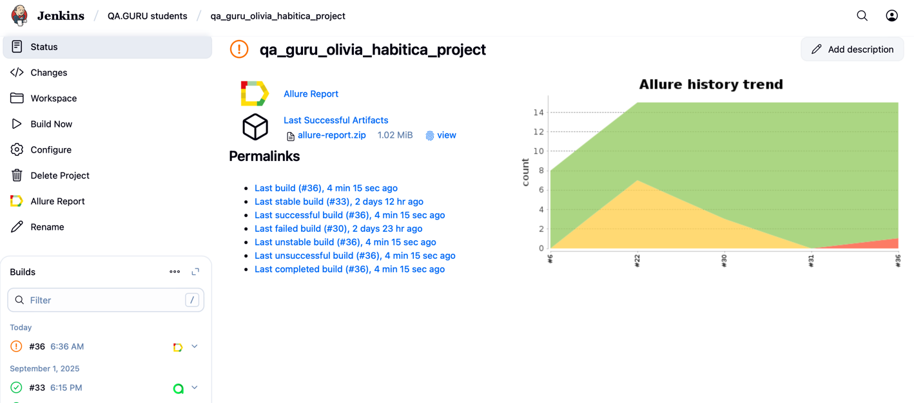
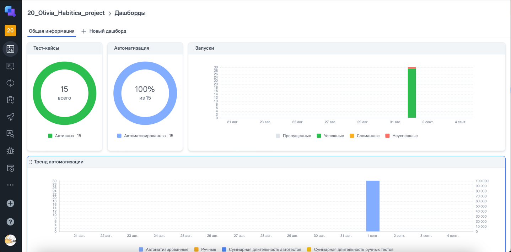
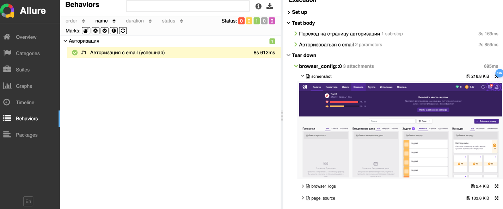
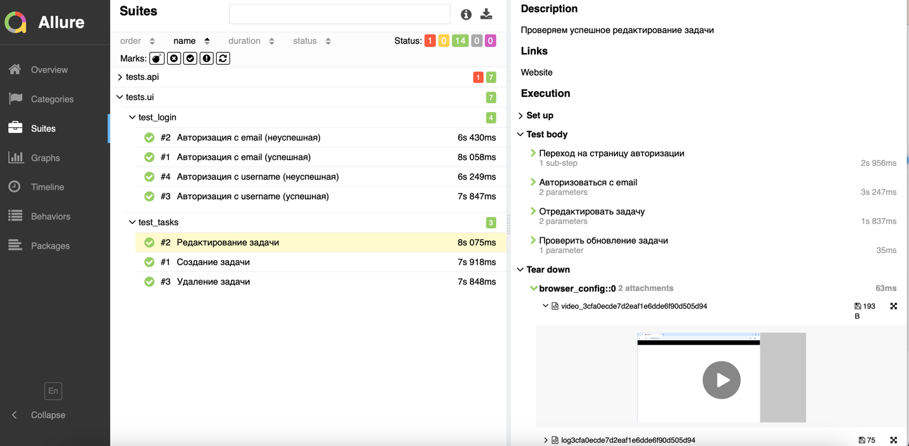

# Фреймворк для автоматизации тестирования открытого менеджера задач Habitica.com

> <a target="_blank" href="https://habitica.com/">habitica.com</a>

---- 
### Особенности проекта:

* Отчеты с видео, скриншотом, логами, исходной моделью разметки страницы
* Сборка проекта в Jenkins
* Запуск UI тестов в Selenoid
* Отчеты Allure Report
* Интеграция с Allure TestOps

----
### Список реализованных проверок:
UI:
* ✅ Успешная авторизация пользователя с email
* ✅ Неуспешная авторизация пользователя с email
* ✅ Успешная авторизация пользователя с username
* ✅ Неуспешная авторизация пользователя с username
* ✅ Создание задачи авторизованным пользователем
* ✅ Редактирование задачи авторизованным пользователем
* ✅ Удаление задачи авторизованным пользователем

 API:
* ✅ Успешная авторизация пользователя с email
* ✅ Неуспешная авторизация пользователя с email
* ✅ Создание задачи авторизованным пользователем
* ✅ Создание задачи неавторизованным пользователем
* ✅ Получение списка задач авторизованным пользователем
* ✅ Получение списка задач неавторизованным пользователем
* ✅ Получение списка задач по фильтру
* ✅ Получение списка задач по id

----
### Локальный запуск
Для локального запуска необходимо: 
- Создать файл .env и заполнить данными авторизованного пользователя. Параметр RUN_MODE оставить в значении "local"
- Выполнить команды:
```
python -m venv .venv
source .venv/bin/activate
pip install -r requirements.txt
pytest .
```
----

### Удаленный запуск автотестов выполняется в Jenkins или в Allure TestOps

> <a href="https://jenkins.autotests.cloud/view/QA.GURU%20students/job/qa_guru_olivia_habitica_project/">Ссылка на проект в Jenkins</a>

> <a href="https://allure.autotests.cloud/project/4903/dashboards">Ссылка на проект в Allure TestOps</a>

#### Для запуска автотестов в Jenkins

1. Открыть <a target="_blank" href="https://jenkins.autotests.cloud/view/QA.GURU%20students/job/qa_guru_olivia_habitica_project/">проект</a>
2. Нажать кнопку `Build Now`
3. Результат запуска сборки можно посмотреть в отчёте Allure TestOps

#### Для запуска автотестов в Allure TestOps


1. Открыть <a target="_blank" href="https://allure.autotests.cloud/project/4903/dashboards">проект</a>
2. В боковом меню перейти на вкладку "Тест-кейсы".
3. Выбрать тест-кейсы для запуска и в массовых действиях выбрать пункт "Запустить"
4. На вкладке Джобы добавить джобу с названием "qa_guru_olivia_habitica_project" и нажать "Отправить"
4. Отслеживать выполнение можно на вкладке<a target="_blank" href="https://allure.autotests.cloud/project/4903/launches">"Запуски"</a>.

----
К allure отчету приложены:
- при локальном запуске:
  - Скриншот
  - Логи браузера
  - Ресурс страницы
  
- при удаленном запуске:
  - Логи браузера
  - Видео прохождение теста 
  

